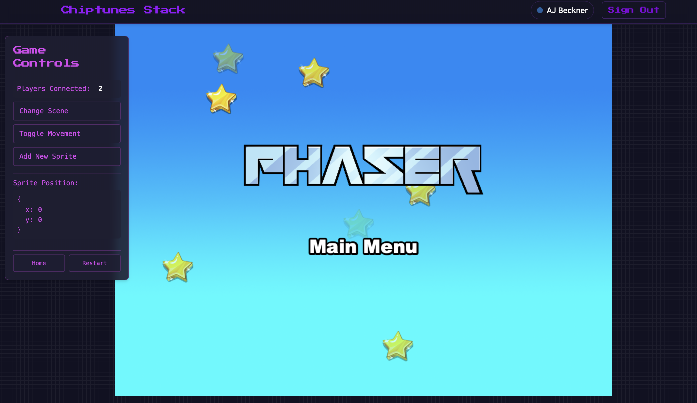

# Chiptunes Stack

A Remix stack for building realtime authenticated multiplayer games with Phaser and Firebase.



## What's in the stack

The Chiptunes Stack is built on the Remix framework and provides everything you need to build multiplayer browser games:

- [Phaser 3](https://phaser.io/) for game development with TypeScript
- [Firebase](https://firebase.google.com/) for authentication and realtime database
- [Remix](https://remix.run/) for server-rendered React
- [TypeScript](https://www.typescriptlang.org/) for type safety
- [Tailwind CSS](https://tailwindcss.com/) for styling
- [shadcn/ui](https://ui.shadcn.com/) for beautiful UI components
- Pixel-perfect retro styling with custom fonts and animations

## Key Features

- **Realtime Multiplayer**: Built-in Firebase integration for player presence, position syncing, and messaging
- **Authentication**: Google authentication with Firebase, including user profiles and persistence
- **State Management**: Seamless state sharing between React/Remix and Phaser
- **Responsive Design**: Works on desktop and mobile browsers
- **Developer Experience**: Hot module reloading, TypeScript, and organized project structure

## Quick Start

```sh
# Clone the repository
git clone https://github.com/yourusername/chiptunes-stack.git
cd chiptunes-stack

# Install dependencies
npm install

# Set up your Firebase project
# 1. Create a Firebase project at https://console.firebase.google.com/
# 2. Enable Authentication (Google provider) and Realtime Database
# 3. Add your Firebase config to .env

# Start the development server
npm run dev
```

## Environment Variables

Create a `.env` file in the root of your project with the following variables:

```
FIREBASE_API_KEY=your-api-key
FIREBASE_AUTH_DOMAIN=your-project.firebaseapp.com
FIREBASE_DATABASE_URL=https://your-project.firebaseio.com
FIREBASE_PROJECT_ID=your-project
FIREBASE_STORAGE_BUCKET=your-project.appspot.com
FIREBASE_MESSAGING_SENDER_ID=your-messaging-sender-id
FIREBASE_APP_ID=your-app-id
```

## Project Structure

- `app/routes/` - Remix routes for different pages (landing, game, login)
- `app/components/` - React components used throughout the application
- `app/lib/` - Utility functions and Firebase integration
- `app/game/` - Phaser game code
  - `scenes/` - Phaser scenes for different game states
  - `PhaserGame.tsx` - React component that initializes Phaser
  - `EventBus.ts` - Communication bridge between React and Phaser
- `app/styles/` - Global CSS and Tailwind configuration
- `public/assets/` - Game assets (sprites, sounds, etc.)

## Firebase Integration

The stack includes a complete Firebase integration with:

1. **Authentication**: User login/signup with Google
2. **Player Presence**: Tracks online players in realtime
3. **Position Syncing**: Syncs player positions across clients
4. **Chat System**: Global chat and direct messaging between nearby players

### Player Presence

The stack automatically tracks player presence. When a user connects:

```typescript
// This happens automatically when a user logs in
setupPresenceTracking(user.uid);
```

When a user disconnects (closes their browser), their `lastSeenAt` property is removed, and they no longer appear in the "Players Connected" count.

## React-Phaser Communication

The stack provides a seamless bridge between React and Phaser:

```typescript
// In React components
const phaserRef = useRef<IRefPhaserGame>(null);

// Access the Phaser game instance
if (phaserRef.current) {
  const scene = phaserRef.current.scene;
  // Interact with the Phaser scene
}

// In Phaser scenes
// Emit events to React
EventBus.emit('player-moved', { x, y });

// In React, listen for Phaser events
useEffect(() => {
  const handler = (data) => {
    // Handle the event
  };
  EventBus.on('player-moved', handler);
  return () => EventBus.off('player-moved', handler);
}, []);
```

## Customizing the Game

### Adding New Scenes

1. Create a new scene file in `app/game/scenes/`
2. Register the scene in `app/game/main.tsx`
3. Make sure to emit the `current-scene-ready` event:

```typescript
class MyScene extends Phaser.Scene {
  constructor() {
    super('MyScene');
  }

  create() {
    // Your game objects and logic
    
    // Let React know this scene is ready
    EventBus.emit('current-scene-ready', this);
  }
}
```

### Styling

The stack uses Tailwind CSS with custom pixel art styling. Modify:

- `app/styles/globals.css` for global styles
- `tailwind.config.js` for theme configuration

## Deployment

```sh
# Build the application
npm run build

# The build output will be in the 'build' folder
# Deploy this to your hosting provider of choice
```

## Learn More

- [Phaser Documentation](https://newdocs.phaser.io/)
- [Remix Documentation](https://remix.run/docs/en/main)
- [Firebase Documentation](https://firebase.google.com/docs)
- [Tailwind CSS Documentation](https://tailwindcss.com/docs)

## Community

Join our community to get help, share your games, and contribute to the stack:

- [Discord](https://discord.gg/phaser)
- [Twitter](https://twitter.com/phaser_)
- [GitHub Discussions](https://github.com/yourusername/chiptunes-stack/discussions)

## License

The Chiptunes Stack is open source software licensed under the MIT license.
